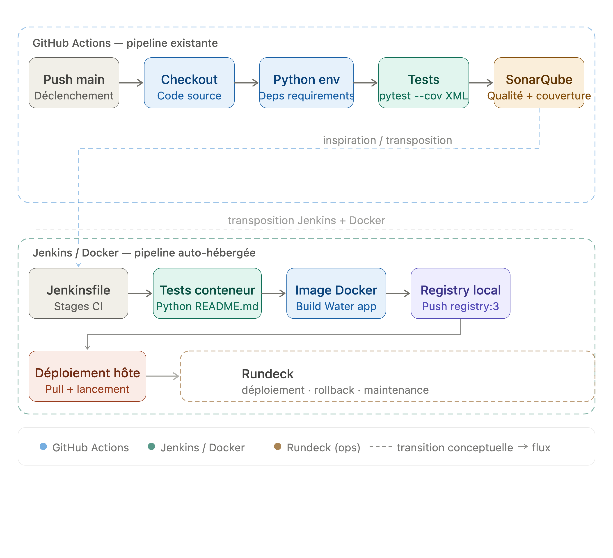

# Questionnaire

## 1. Definition des pipelines CI/CD dans le depot Github

Dans le depot Github `turban-sizzle/fluffy-octo-sniffle`, la definition de la pipeline CI/CD se trouve dans le dossier suivant :

```text
.github/workflows/
```

Le depot contient un workflow principal :

```text
.github/workflows/build.yaml
```

Ce fichier definit une pipeline Github Actions nommee `Build`. Elle se declenche sur un `push` vers la branche `main`. La pipeline utilise un runner `ubuntu-latest`, recupere le code avec `actions/checkout`, configure Python avec `actions/setup-python`, installe les dependances avec `pip install -r requirements.txt`, lance les tests avec couverture via `pytest --cov . --cov-report xml`, puis execute une analyse SonarQube avec `SonarSource/sonarqube-scan-action`.

## 2. Schema du pipeline CI/CD

Le schema ci-dessous reprend les etapes principales du pipeline CI/CD du projet Water.

```markdown

```


## 3. Reproduction de la pipeline avec Jenkins

Oui, la pipeline peut etre reproduite avec Jenkins dans ses grandes etapes.

La pipeline Github Actions actuelle effectue les actions suivantes :

- recuperation du code source ;
- utilisation d'un environnement Linux ;
- configuration d'un environnement Python ;
- installation des dependances depuis `requirements.txt` ;
- execution des tests avec couverture ;
- generation d'un rapport de couverture XML ;
- analyse SonarQube avec un token fourni par les secrets Github.

Dans Jenkins, ces etapes peuvent etre representees dans un `Jenkinsfile` avec des stages comme `Checkout`, `Tests`, `Coverage` et `SonarQube`.

En revanche, une reproduction strictement identique necessite des informations complementaires :

- la valeur du secret Github `SONAR_TOKEN` ;
- la configuration exacte du projet SonarQube ;
- l'URL de l'instance SonarQube utilisee par l'action Github ;
- la version Python reellement utilisee, car le workflow fait reference a `${{ matrix.python }}` sans declarer de strategie `matrix` visible dans le fichier ;
- les eventuelles variables d'environnement configurees dans Github ;
- les permissions exactes du workflow Github Actions ;
- les regles de protection de branche liees a la pipeline.

La logique generale est donc reproductible avec Jenkins, mais certains elements d'environnement et de securite doivent etre fournis pour obtenir une equivalence complete.

## 4. Critique du fichier `compose.yaml` a la racine du projet `fluffy-octo-sniffle`

Le fichier `compose.yaml` du depot contient deux services : `sonarqube` et `cli`.

Plusieurs points peuvent etre critiques :

- le service `sonarqube` utilise l'image `sonarqube:latest`, ce qui rend l'environnement non reproductible car la version exacte peut changer ;
- le service `cli` utilise aussi une image non versionnee explicitement : `sonarsource/sonar-scanner-cli` ;
- un token SonarQube est ecrit en clair dans le fichier Compose avec `SONAR_TOKEN=...`, ce qui est une mauvaise pratique de securite ;
- le port `9000:9000` est publie directement sur la machine hote, ce qui peut creer un conflit si un autre service utilise deja ce port ;
- il n'y a pas de `healthcheck` sur SonarQube, donc le service `cli` peut demarrer avant que SonarQube soit pret ;
- il n'y a pas de `depends_on` entre `cli` et `sonarqube` ;
- il n'y a pas de volume persistant pour les donnees SonarQube, donc les donnees et la configuration peuvent etre perdues ;
- il n'y a pas de base PostgreSQL dediee, alors que SonarQube doit normalement etre associe a une base de donnees fiable pour un usage durable ;
- aucune limite de ressources n'est definie pour SonarQube. Un service comme SonarQube peut consommer beaucoup de memoire et de CPU ; sans contrainte comme `mem_limit` ou `cpus`, il peut degrader le reste de la machine hote ;
- le montage `.:/usr/src` donne acces a tout le repertoire courant dans le conteneur d'analyse, ce qui peut etre trop large ;
- le commentaire contient un chemin local absolu d'un poste de developpement, ce qui nuit a la portabilite du fichier.

Pour un environnement CI/CD propre, il faudrait versionner les images, sortir le token du fichier Compose, ajouter des controles de sante, definir les dependances, prevoir une persistance, encadrer les ressources et rendre le fichier portable.

## 5. Augmentation du nombre de conteneurs du service SonarQube

Si on augmente le nombre de conteneurs associes au service `sonarqube`, le premier probleme sera le port publie :

```yaml
ports:
  - "9000:9000"
```

Plusieurs conteneurs ne peuvent pas publier le meme port `9000` sur la machine hote en meme temps. Docker renverra donc un conflit de port.

Il y a aussi un probleme applicatif : SonarQube ne se scale pas simplement en dupliquant le conteneur. Meme avec un load balancer devant plusieurs conteneurs, l'edition Community ne permet pas de faire un cluster SonarQube. Pour une architecture haute disponibilite avec plusieurs noeuds applicatifs, il faut utiliser l'edition Data Center, avec une configuration prevue pour cela et une base de donnees partagee.

## 6. Communication entre plusieurs stacks Compose

Pour permettre a plusieurs stacks Docker Compose de communiquer entre elles, il faut utiliser un reseau Docker commun.

La solution habituelle consiste a creer un reseau Docker externe, puis a le declarer dans chaque fichier Compose.

Exemple :

```yaml
networks:
  shared_network:
    external: true
```

Ensuite, les services des differentes stacks peuvent rejoindre ce reseau commun et communiquer avec les noms DNS des services ou avec des alias.

## 7. Acces a une ressource disponible uniquement sur la machine hote

Pour acceder depuis un conteneur a une ressource disponible uniquement sur la machine hote, on peut utiliser le nom DNS special :

```text
host.docker.internal
```

Avec Docker Desktop, ce nom permet de joindre l'hote depuis un conteneur.

Sur Linux, il peut etre necessaire d'ajouter explicitement l'entree suivante dans le service Compose :

```yaml
extra_hosts:
  - "host.docker.internal:host-gateway"
```

Cela permet au conteneur de resoudre `host.docker.internal` vers la passerelle de la machine hote.

## 8. Alias DNS complementaire entre deux services

Pour etablir un acces complementaire avec un autre alias DNS entre deux services, il faut utiliser les alias de reseau Docker Compose.

Exemple :

```yaml
services:
  app:
    networks:
      backend:
        aliases:
          - api-interne

networks:
  backend:
```

Le service reste accessible avec son nom de service, mais il peut aussi etre joint avec l'alias DNS declare sur le reseau.

## 9. Remplacement de l'injection de valeurs dans une variable d'environnement

Pour eviter d'injecter directement une valeur sensible dans une variable d'environnement, il faut utiliser un secret ou un fichier monte dans le conteneur.

Avec Docker Compose, on peut declarer un secret :

```yaml
services:
  cli:
    secrets:
      - sonar_token

secrets:
  sonar_token:
    file: ./secrets/sonar_token.txt
```

Le conteneur lit alors la valeur depuis un fichier dans `/run/secrets/` au lieu de recevoir directement le secret dans l'environnement.

Pour le cas du depot `fluffy-octo-sniffle`, cela permettrait de remplacer le token SonarQube actuellement present en clair dans `compose.yaml`.

## 10. Image basee sur `postgres:latest` avec mot de passe par defaut

```dockerfile
FROM postgres:latest
ENV POSTGRES_PASSWORD=mypassword
```

Cette reponse correspond a la demande technique en deux lignes, mais elle n'est pas securisee car le mot de passe est integre directement dans l'image.

## Etape 9 - Utilisation de Rundeck

Rundeck est un outil d'automatisation des operations. Il permet de creer des jobs executables manuellement ou automatiquement, de cibler des serveurs Linux, d'enchainer plusieurs commandes, de gerer des parametres, de conserver les logs d'execution et de limiter les actions possibles selon les droits des utilisateurs.

Dans une architecture auto-hebergee avec Git, Jenkins, Docker, PostgreSQL et Rundeck, Jenkins reste adapte a l'integration continue : recuperation du code, tests, construction d'image et publication dans un registre Docker. Rundeck est plus adapte aux operations d'exploitation sur les serveurs cibles.

### Etape associee 1 : deploiement applicatif

Apres l'etape Jenkins qui construit et pousse l'image `localhost:5001/water:ci` dans le registre Docker local, Rundeck pourrait prendre le relais pour deployer l'application sur la machine hote ou sur un serveur Linux.

Un job Rundeck pourrait executer les actions suivantes :

- recuperer la derniere image depuis le registre local ;
- arreter l'ancien conteneur applicatif s'il existe ;
- lancer le nouveau conteneur avec les ports et variables necessaires ;
- verifier que l'application repond correctement sur son endpoint `/water`.

Cette etape correspond au deploiement operationnel. Elle evite de donner trop de responsabilites a Jenkins sur les serveurs de production.

### Etape associee 2 : rollback

Rundeck pourrait aussi fournir un job de retour arriere. En cas d'echec apres deploiement, l'operateur pourrait choisir un ancien tag Docker et relancer l'application avec cette version.

Un job de rollback pourrait executer les actions suivantes :

- demander en parametre le tag d'image a restaurer ;
- arreter le conteneur actuellement deploye ;
- relancer le conteneur avec l'image choisie ;
- verifier que le service repond a nouveau ;
- conserver le resultat dans les logs Rundeck.

Cette etape est importante car elle fournit une procedure controlee en cas d'incident.

### Etape associee 3 : operations de maintenance

Rundeck pourrait egalement etre utilise pour des operations post-deploiement :

- nettoyage d'anciennes images Docker ;
- consultation ou export des logs applicatifs ;
- redemarrage controle d'un service ;
- sauvegarde ou restauration de donnees PostgreSQL ;
- execution de controles de disponibilite apres livraison.

L'interet de Rundeck est donc de separer les responsabilites : Jenkins automatise la construction et la verification du code, tandis que Rundeck orchestre les actions d'exploitation sur les serveurs avec des logs, des droits et des parametres adaptes.
